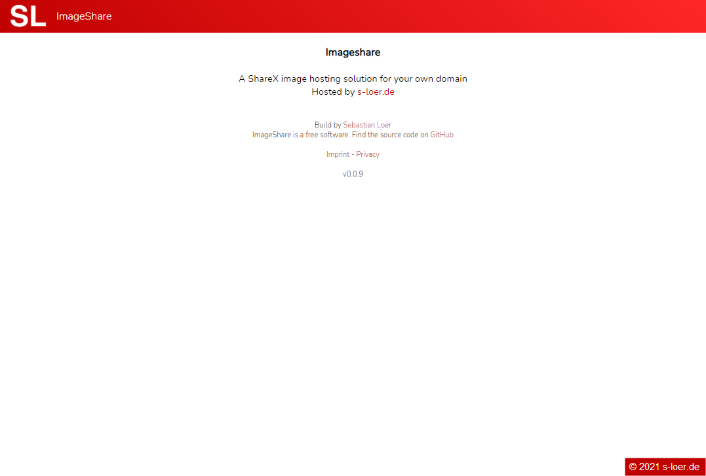
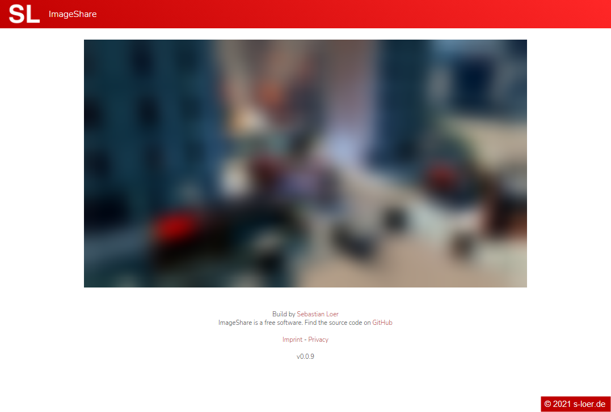
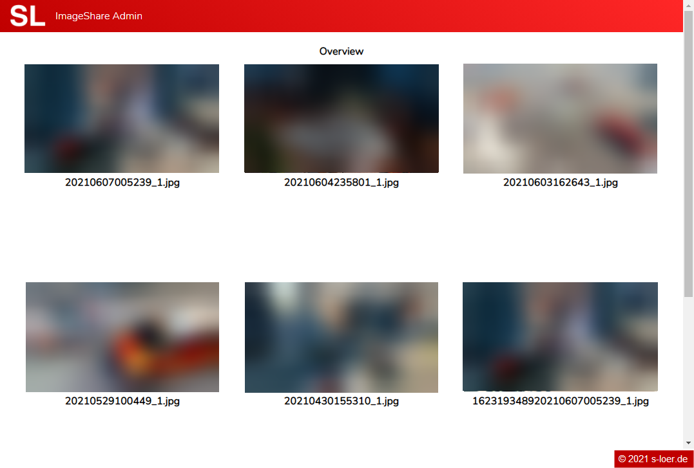

# ImageShare

A ShareX image hosting solution for your own domain

## Disclaimer

This is my approach building a little imageserve webpage. Maybe it's good, maybe it's not.

## Branches

**development** : \
contains the most current development state of this website with all new features \

**master** : \
contains the current live state of this website which is deployed on my webserver

## Server setup

The webpage is written in php. This code has to be put on a webserver which supports php.

## Configuration

You can change every value in the `config.php` file which is located in the `config` folder. A sample file is provided, just rename the file `config.sample.php` to `config.php`. Then change the values to your needs and you are good to go.

| Option              | Description                                                       |
| ------------------- | ----------------------------------------------------------------- |
| $title              | html title of the page                                            |
| $imprint            | link to the imprint of the page                                   |
| $privacy            | link to the privacy document of the page                          |
| $headerColors       | two colors which should be used for the header bar effect (wip)   |
| $backgroundColors   | two colors which should be used for the background effect         |
| $fontColor          | color of the text on this page                                    |
| $linkColor          | color of the links on this page                                   |

## Add a User

When you want to add a user you have to add this Code `array_push(self::$users, new UserDto(1, 'USERNAME', 'NAME', 'FOLDER', 'URLPART', 'APIKEY', 'IP', [DOMAIN1, DOMAIN2], date("Y-m-d H:i:s"), date("Y-m-d H:i:s")) );` to the init block of the Config Class in the `config.php` file. \
In the code you can change the name to what ever you want. \
The username is used for login into the management part of the application in combination with the apiKey. \
The folder is the folder name where the images are saved in. \
The url part is the users part in the url of the image link. \
The api key is used for authentication  when uploading a image. It need to be set in the headers  `X-API-KEY`. \
When you want you can restrict the usage of the api key to a single ip. Only when set it will be used. \
Also you must enter a domain on which the user is allowed to upload, you also can add multiple domains.

Now you can use the new api key to upload images to your ImageShare.

## Config generator
A config generator for this application is currently in the work by myself. When it is finished i will add a link that you can use it to create your config.php file.

## View Uploaded Images
You can access a login page under `url/login` where you can use your username and apiKey to login. There you can view every image you have uploaded to his application. More features for this are in development.

## Logo, Favicon

When you want to use a logo or a favicon you have to put them into the `static` folder:

- favicon.ico (32x32px)
- logo.png (128x80px)


## Screenshots








## ShareX

Screen capture, file sharing and productivity tool

Free, Open source, No advertisments, Lightweight

ShareX is a free and open-source screenshot and screencast utility for Microsoft Windows. It is published under the GNU General Public License. The project's source code is hosted at the GitHub code-sharing and code development platform. It is also available on the Windows Store and Steam. [... wikipedia.org](https://en.wikipedia.org/wiki/ShareX)


## Config for ShareX

Add this as a uploaders config in your shareX.

```
{
    "Version": "12.4.1",
    "Name": "NAME",
    "DestinationType": "ImageUploader",
    "RequestMethod": "POST",
    "RequestURL": "URL/upload",
    "Headers": {
        "X-API-KEY": "APIKEY"
    },
    "Body": "MultipartFormData",
    "FileFormName": "image",
    "RegexList": [
        "[^,]*$"
    ],
    "URL": "$json:data.link$"
}
```

Notice, after version 0.0.9 the upload.php was renamed to upload

## Link
[ShareX](https://getsharex.com/)

